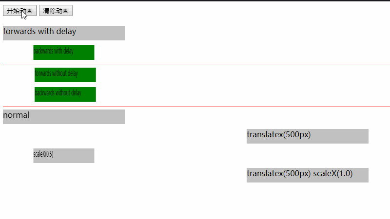

# Animation properties

在我们看更多的动画示例之前，先了解一下`animation`的属性。

与`transition`属性一样，`animation`可以使用简写属性形式，也可以单独指定这些属性。

### animation-delay

与`transition-delay`类似，此属性表示在开始之前动画的等待时间。在定义多个动画的情况下特别有用。

如果定义的动画是循环的，在这种情况下，delay 属性不会每次循环都有效的，只有在给元素添加上动画效果的时候才有效。（只有第一次循环前会有等待时间，其余的就没有了）

实际上可以给这个属性一个负值，比如`-1s`。动画会直接从第1s开始执行，就好像这1s时间已经过去了。

### animation-direction

动画通常从 0% 开始，到 100% 结束。`animation-direction` 使用 `normal`，`reverse`，`alternate` 和 `alternate-reverse` 来控制方向。（从开始到结束我们可以看作是一个有向的变化）

“Reverse”是指从 100% 播放（或循环）到 0%，而 “alternate” 指动画轮流反向播放，即从 0% 播放到 100% 然后再播放到 0%。

### animation-duration

动画完成一个周期所需要的时间。类似于`transition-duration`，以秒或毫秒计,如`1s`、`200ms`。

### animation-fill-mode

默认情况下，动画播放完成元素返回其正常状态。使用`animation-fill-mode`，我们可以定义元素在动画结束或开始前的状态。

使用`forwards`表示当动画完成后，元素属性保持最后一个关键帧的值。使用 `backwards`表示动画完成后，元素属性变成第一帧（这个第一帧不是关键帧的第一帧，[CodePen Demo](https://codepen.io/jiangxiaoxin/pen/QzWYwG)）的值。【Tips:`animation-fill-mode` 除了这里说的两个之外还有多个可选值。】

例子:[bouncer animation on Hop.ie](http://hop.ie/)。 使用`forwards`，动画播放一次并在最后一帧结束。【Tips:这个例子貌似没有啊，我翻遍了也没找到】

> 这里多添了个例子来说明 forwards 和 backwards（原作者并没有写）。  
> 在这个[例子](https://codepen.io/jiangxiaoxin/pen/QzWYwG)里使用了 animation-delay 和 animation-fill-mode。从效果上来看，设置 backwards，点击“开始动画”之后，backwards 会立刻变成动画真实过程(animation-duration)第一帧的样子，一直持续整个 animation-delay 时间，然后开始变化，最后动画结束后又变回了最一开始没有添加动画时的状态。

### animation-iteration-count

这是动画播放的次数。默认情况下，它将播放一次。也可以指定一个数字，或指定"infinite"以使其永久循环。

### animation-name

`animation-name`指的是动画使用的`keyframes`的名字。例如，如果`animation-name`设置为“foo”，它将使用一组下面这样的关键帧，如：

    @keyframes foo {
      ...
    }

### animation-play-state

如果您需要暂停或恢复动画，则可以使用此属性执行操作。值为`running`或`paused`，默认为`running`。可以使用JavaScript设置此值，控制动画播放状态。

### animation-timing-function

此属性与transitions中定时函数属性的值相同，但略有不同。在 `transition`里时间函数（例如`ease-out`）是作用于整个transition，但`animation`里是作用于关键帧之间。

这意味着以下关键帧将看到动画快速启动并减速至50%，然后快速开始并在100%之前减速。

    @keyframes foo {
      0%{
        / *动画开始时变化速度很快，然后按照ease-out的时间函数，到50%之前越来越慢* /
      }
      50%{
        / *然后又开始的时候很快，然后慢慢减速至100%的时候* /
      }
      100%{
        / * 结束 * /
      }
    }

这看起来有些复杂。通常在创建关键帧动画时，我会选择`linear`，用使用`keyframes`控制动画的节奏。

`cubic-bezier`与动画一起使用可以产生一些很好的效果，大家可以尝试一下。

## Using timing functions within keyframes

值得注意的是，当为动画指定时间函数时，这个函数会应用到动画的*每个关键帧*之间。

也就是说如果有四个关键帧，并且使用ease-out，那么在上一帧与下一帧之间，变化速度会越来越慢。

所以我们通常会将动画的计时功能定义为linear，然后在每个关键帧的上控制速度：

    @keyframes my-animation {
      0%{
      ...
      animation-timing-function: linear;
      }
      50%{
      ...
     animation-timing-function: ease-out;
      }
    }

在这种情况下，动画的前半部分将是线性的，而后半部分将使用`ease-out`计时功能。

## Homework

这里有一个[例子](http://codepen.io/donovanh/pen/MYMJRd?editors=010)。尝试更改其中一些属性，看看会发生什么。